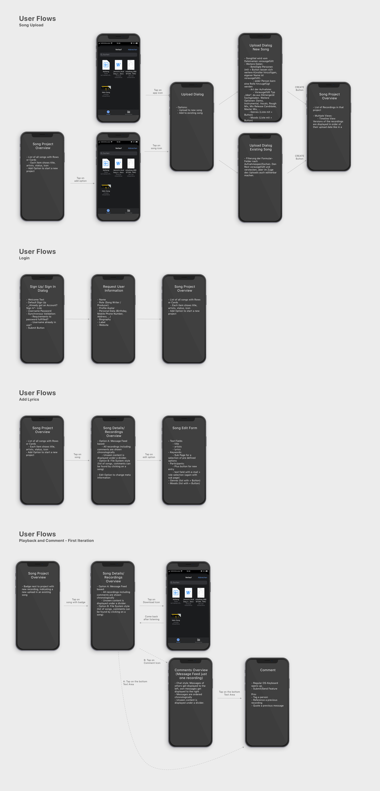

# Wireframes

As a high fidelity wireframing tool we used [Adobe XD](https://www.adobe.com/de/products/xd.html?sdid=88X75SKP&mv=search&ef_id=EAIaIQobChMI182Z_6e76gIV2-vtCh3WjQufEAAYASAAEgLvkvD_BwE:G:s&s_kwcid=AL!3085!3!340667133503!e!!). It is a free to use UI- and UX-prototyping tool, which allows us to create app wireframes for various devices. Individual components can be defined and reused which resembles the UI component approach that can is used in development. In a prototyping environment the individual screens can be linked, animations can be defined and tested in a simulator. We used [Sketch](https://www.sketch.com/) to design documentation elements and to sketch out diagrams for our architecture and user research results.

### First Iteration: User Flows

As it is common in User Centered Design, we started prototyping on a conceptual level and refined our prototypes after an evaluation stage. 

The first iteration on prototypes was a wireframe that described just the user flow through the application without user interface elements. This was done using Sketch as a prototyping tool.

### Second Iteration: High Fidelity Prototype

**License note**: All image assets were downloaded from [Unsplash](https://unsplash.com/) and are copyright free. The used icons are part of the [Google Material Icon Set](https://github.com/google/material-design-icons) which is licensed under a Apache 2.0 License. Our design system is heavily inspired by the [Google Material](https://material.io/) and [Apple Human Interface Guidelines](https://developer.apple.com/design/human-interface-guidelines/).

In general, we have tried to keep everything relatively minimalistic in the UI and UX. The app should be intuitive to use and contain common conventions. Our design language is more in line with Apple's guidelines, whereby we have tried to adapt the material components.

We try to keep our app as responsive as possible, as our use case could cover a wide range of devices. But since we see the most potential in smartphones, we have designed our app mobile first. Smartphones offer the most potential in our use case, because one can quickly capture ideas without forgetting them on the way to your computer or tablet.

### Sign Up, Sign In and Setup Profile

|  |  |  |  |
| ------------------------------------------------------ | ------------------------------------------------------ | ------------------------------------------ | ---------------------------------------------- |
|                                                        |                                                        |                                            |                                                |

After starting the app, the user is first shown our Sign In view, unless the user had already logged in before and is not opening the app for the first time. Only username and password are required in the Sign In screen. If a user has not yet registered, he can be redirected to the Sign Up screen via a route below. In the Sign Up screen the user will be asked to create an account using a username, email and password. After successful validation of the entered data, the user is redirected to his profile page, where he can or must enter further information about himself. Once a user has successfully logged in and set up his profile, he can navigate to the first tab of the app.

### Project Overview

|  |  |
| ---------------------------------------------------- | ------------------------------------------ |
|                                                      |                                            |

The first tab of the application contains a list of all song projects of the user or one of his musical partners. These song projects are displayed as a list of entries/rows and contain general information to characterize the project. An entry consists of a cover image, title, artist and participating members. Selecting a list entry allows navigation to the respective details. In the header of the view there is a button for adding new song projects next to a title. To create a song project, the user is presented with a mask in which he can enter and select information about the new project. Adding is confirmed by pressing a button. The user is then redirected to the project overview.

### Project Details

|  |  |
| -------------------------------------------------- | -------------------------------------------- |
|                                                    |                                              |

The previously mentioned detail view displays general information of the project, provides the possibility to edit it and contains the main features in the body. The header contains the same information as in the song overview to maintain data consistency. An edit icon redirects the user to the mask already known from adding song projects in which the entered data is displayed and can be edited

### Recordings feature

|  |  |  |
| -------------------------------------------------- | ---------------------------------------------------- | ------------------------------------------------------ |
|                                                    |                                                      |                                                        |

The body of the details view of two tabs from which the Recording Tab (_Files_) is selected by default. In this section all recording files of the project are displayed in a grid. The advantage of a grid is the possibility to show more details than e.g. in a list type view. The grid items show the date of creation, a label to classify the file and a short description of the content or intention. Furthermore, a picture of the creator shows who uploaded the file. Every file also has a playback feature to listen to the recording.

The first entry in the grid shows a button, which allows adding recording files. When pressed, the user is directed to a form for uploading where the user can select a file on his device and set the respective details.

For the sake of consistency, again, the same form is used for editing the recording. This can be reached by tapping the grid item.

### Discussion feature

|  |  |
| ------------------------------------------------------------ | ------------------------------------------------------------ |
|                                                              |                                                              |

The second tab of the detail view contains the discussion feature. Here members that participate in a song project can exchange informations on the song level. For this purpose, a chat with outgoing messages on the right and incoming messages from other members on the left is displayed. This convention of a chronological message history was adopted from existing messengers like WhatsApp or Telegram. In order to be able to reference a certain file, the linking from files to messages and an inline recording player for the linked file that snaps to the top of the chat were sketched out. 