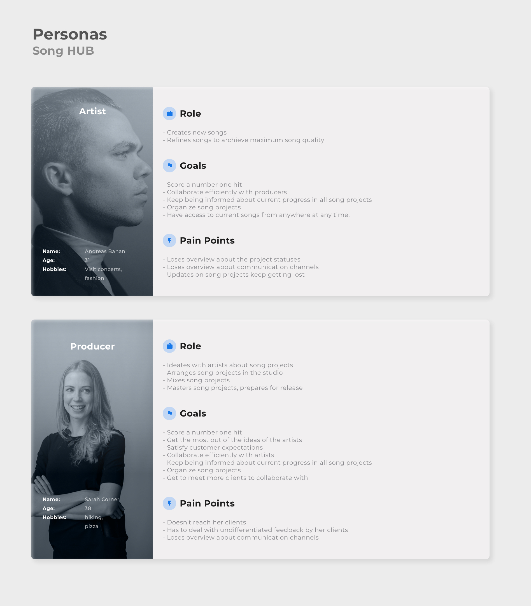

# Personas

The following graphic shows both user roles (artist and producer) that are represented in our application. The description of each entity is broken down into roles within the music industry, personal goals and pain points in current projects.

To be able to consider the needs of these personas in the development of the app, we defined the following user stories:

##### Artist

- As an artist, I want to be able to organize my music projects by collecting my ideas centrally to focus on creativity. 
- As an artist I would like to share and discuss my current progress with participating entities, so that I can incorporate feedback and suggestions for improvement into my creative process.

##### Producer

- As a producer, I would like to be kept informed about the process of making music with a collaborating artist so that I can better understand their ideas and incorporate them into my creative part.

