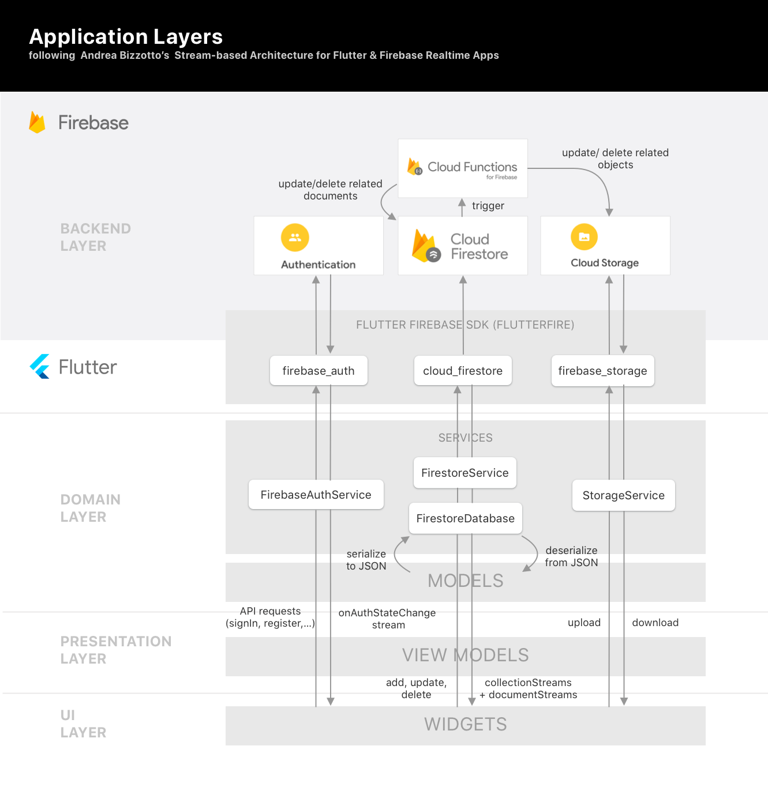
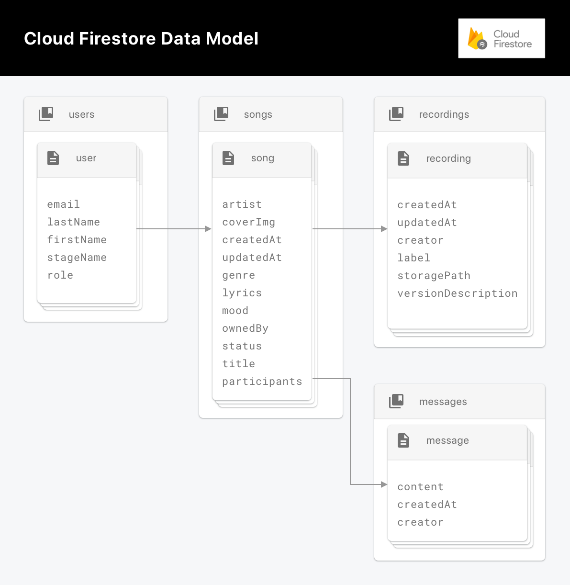

# Architecture

### Information architecture

Our App is based around a reference architecture of Andrea Bizzotto which he calls [Stream-based Architecture for Flutter & Firebase Realtime Apps](https://github.com/bizz84/starter_architecture_flutter_firebase). 

This architecture consists of various layers, each with its own, distinct purpose following the single responsibility principal.

The backend related tasks are abstracted using Firebase, which is a Backend as a Service (BaaS). Those tasks are **user authentication** (user sign in and user sign up with Email/Password Authentication), storing and providing **app data** in real time and storing **binary objects** like images or audio files. The services that fulfill those requirements are Firebase Authentication, Firebase Cloud Firestore and Firebase Storage. In addition to that, the denormalized data gets updated by Firebase Cloud functions that are triggered when changes in the affected source documents occur.

The client side architecture leverages the unidirectional data flow pattern in which data flows downwards through all layers, ending at the widgets and events flow upwards, resulting in API calls.

The beforementioned application layers are the Domain Layer, the Presentation Layer and the UI Layer: 
The Domain Layer consists of so called **services**, which are stateless, singleton classes that expose pure functions. These functions serve as an abstraction over the Firebase APIs and transform the data to a domain-specific format using data **models**. Data models itself are **immutable**, strongly typed classes that define a named constructor `fromMap()` to deserialize the JSON format which is a Dart `Map` into a class instance.

The Presentation Layer uses so called **view models** which are classes that access the service functions and expose the data in the format that the corresponding widgets expect. Usually, the view model functions combine different streams using the Stream extension APIs from **rxdart**.

The UI Layer uses the **provider**-Package to make the stream data available to all descending child widgets and to provide scoped access to the services from within the widgets. In addition to that, the UI layer uses the **StreamBuilder** widget to build the widgets with the realtime snapshots of the streams. As of the time of writing, "Provider is the recommended way to do State Management for apps of all sizes." (**Chris Sells – Product Manager, Flutter**. June 19, 2019).

### Data persistence and permissions
As mentioned before, we used Cloud Firestore and Firebase Storage to persist the user data. 

Cloud Firestore is a realtime NoSQL, document based database. These kinds of databases store data in the form of **documents** that get organized in **collections** which are groups of documents.

Since Cloud Firestore supports so called **Collection Group Queries**, which allows to query documents across parents by their collection ID, we decided to organize our data in a nested form with many subcollections.

The schema is **denormalized** which means that there is duplicated data and the documents are optimised for fast reads without joins. As a result in most of the client views one realtime listener on either a collection, a document or a collection group is enough to retreive all relevant data for that view.

To keep the denormalized data in sync, a strategy to update the duplicates is needed. We decided to address this topic with Firebase Cloud Functions which are serverless functions that are deployed to Firebase and automatically run on certain triggers. 

Finally a concept for permissions is needed as the system requires user collaboration. Cloud Firestore comes with so called **Security Rules** which allows to restrict document access based on parameters like the authId of the request but also on information that is stored on the ressources that are accessed. As an example, to share access on songs we then defined a property `participants` on the song document which holds all userIds that have read, write and update access. This property could then be accessed in a Security Rule and access could be restricted to users that are part of that participants array.

##### A diagram of the resulting NoSQL data model can be seen below

