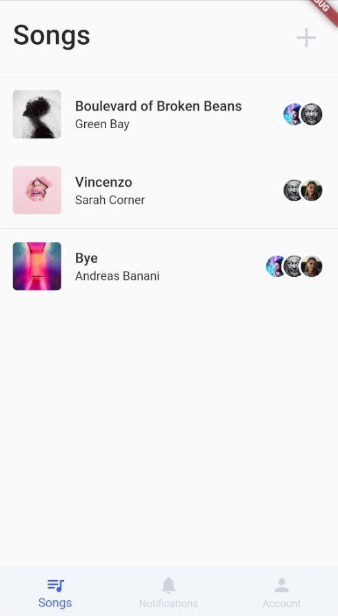

# Project Log

This capter contains all sprint reports sorted by date.

## Exploratory Sprint

#### Date

29.04.2020 - 13.05.2020

#### Members
* Pascal Schlaak (MLD)
* Tim Weise (MIN)

### What did we accomplish?
After getting our idea approved, we started to set up our development environment consisting of **Adobe XD** as Wireframe/Prototyping tool, **Visual Studio Code** as an Editor.

#### Backlog tasks

| Task                          | Status      |
| ----------------------------- | ----------- |
| Refined idea                  | Done        |
| Competitive analysis          | Done        |
| Identify unique features      | Done        |
| Define functionality of App   | Done        |
| Requirements for MVP          | Done        |
| User stories                  | Done        |
| Define use cases              | Done        |
| Visualize data flow           | Done        |
| Research technologies         | Done        |
| General software architecture | Done        |
| Wireframes                    | In Progress |
| Information architecture      | In Progress |

#### Discuss competitive analysis
In our competitive analysis, we found the following competitors:

* Songspace
* Jammber
* Synchtank
* Soundgizmo
* Auddly

Pain points:

* They focus on commercial view
* Cloud data hub for projects
* Defining and calculating splits of participants
* General versioning of song progress

Our unique selling points:

* We want to focus on the creative perspective
* Feature to dicuss the current version of song/components of song with participants
* More detailed versioning of songs/components

#### Wireframes
In our first wireframing approaches we accomplished:

* First iteration of wireframe consisting of stock material design elements
* Second iteration of wireframe simplifying layout (reduced hirarchy, removed unnecessary elements, ...)
* First system run

### What hinderances/risks did/do we face?
* Two Group members left because the other students chose different courses &rightarrow; Only two participants
* Different development environments (MacOS, Ubuntu, Sketch, XD, Android studio, VS Code, ...)

### What do we plan to tackle in the next sprint?
1. Improve wireframing
2. Setup flutter project and get more into technologies
3. Elaborate architecture

## Architectual Spike Sprint

#### Date

13.05.2020 - 27.05.2020

#### Members

* Pascal Schlaak (MLD)
* Tim Weise (MIN)

### What did we accomplish?

Set up our flutter project in Bitbucket repository. Structured project in components, screens, etc. Added first UI elements and refactored layout. Setup apps for iOS and Android in Firebase. Added Firestore with first collection and dummy documents. Added connection to Firestore instance from Flutter app to fetch dummy documents and render in *Songs overview* and *Song details*.

#### Backlog tasks

| Task                                                         | Status      |
| ------------------------------------------------------------ | ----------- |
| Setup Flutter project in repository                          | Done        |
| Structure Flutter project                                    | Done        |
| Develop UI elements (general use components/screen specifics) | In progress |
| Create navigator rules for view seque                        | Done        |
| Create providers for information flow                        | Done        |
| Created iOS and Android apps in Firebase and instantiated Firestore db | Done        |
| Specify Firestore dependencies in Flutter app                | Done        |
| Integrate Firestore connection and requests                  | Done        |
| Fetch dummy data from Firestore and render in app            | Done        |

#### Wireframes

Improved UI experience by reducing visual elements and refining user-flow. Reduced number of colors and specified drop shadows.

#### Feature table

Compared features of competitors to clarify our added value.

| **Feature**    | **Songspace** | **Synchtank** | **Soundgizmo** | **Auddly** |
| :------------- | ------------- | ------------- | -------------- | ---------- |
| Song overview  | X             | X             | X              | X          |
| Song details   | X             | X             | X              | X          |
| Add/edit song  | X             | X             | X              | X          |
| File organizer | X             | X             | X              | X          |
| **Comments**   | -             | -             | -              | X          |
| **Chat**       | -             | -             | -              | -          |
| Audio player   | X             | X             | -              | X          |
| **Version**    | X             | -             | -              | X          |

#### Integrate functionality

### What hinderances/risks did/do we face?

* Multi-platform development often resulted in errors after pulling changes and building for other os.
* Build process for iOS takes much longer than expected which is a document bug in Flutter Fire.

### What do we plan to tackle in the next sprint?

Demo core functionality:

* Integrate core feature(s)
	* Add/edit song
	* Prio B: Discussion
* Add more dummy data

## Alpha Sprint

#### Date

27.05.2020- 10.06.2020

#### Members

* Pascal Schlaak (MLD)
* Tim Weise (MIN)

### What did we accomplish?

We integrated user authentication to later allow multi user collaborations. Songs are now mapped to a user/owner. We added security rules in Firestore and Storage to restrict access.  A user can now register or sign in to the app by email and password. A user can now add new song projects and edit existing songs projects.  While editing a song a user can enter required files and add a cover image from the OS device gallery. We also refactored the data stream to fetch song objects. Details of a song now contain files, which are also fetched from dummy data in Firestore. Several front end components for the discussion feature were added too. 

#### Backlog tasks

| Task                                            | Status      |
| ----------------------------------------------- | ----------- |
| Integrate multi user authentication             | Done        |
| Add "Sign In" and "Sign Out" screen             | Done        |
| Refactored Firestore and Storage schema         | Done        |
| Add user access rules for Firestore and Storage | Done        |
| Add more dummy data                             | Done        |
| Refined "Add Song" screen                       | Done        |
| Created "Edit Song" screen                      | Done        |
| Refactored Firestore stream                     | Done        |
| Create "Records" feature in "Song Details"      | In progress |
| Create "Discussion" feature in "Song Details"   | In progress |

#### Wireframes

Improved UI experience by reducing visual elements and refining user-flow.

#### Integrate main technologies

Our main features exist of user authentication, data streams and song details.

### What hinderances/risks did/do we face?

* Database schema required multi stream concatenation &rightarrow; Refactored Firestore and Storage schema 
* Exceeding Storage free plan every afternoon due to too high data exchange

### What do we plan to tackle in the next sprint?

Feature complete:

- Implement all features (mostly backend services)
- Finish "Add Song" and "Edit Song"
- Integrate file picker and upload
- Integrate message upload and fetch
- Optional: Integrate multi user collaboration

## Beta Sprint

#### Date

10.06.2020 - 02.07.2020

#### Members

* Pascal Schlaak (MLD)
* Tim Weise (MIN)

### What did we accomplish? 

We decided to refactor our Firestore database model again due to improvement opportunities. We added error handling especially for features where we initiate connections to Firebase. Integrated snackbars can now show the status in many features.

#### Backlog general tasks

| **Task**                                                     | **Status** |
| ------------------------------------------------------------ | ---------- |
| Refactor database model                                      | Done       |
| Refactor user authentication                                 | Done       |
| Error handling of firebase functionality with snackbar status | Done       |
| Cloud functions to handle database entry updates and recursive deletion | Done       |

We refactored user access to display only granted information. Furthermore, we added the user settings feature in the account view to add and update user data.

#### Backlog users feature

| **Task**                                                     | **Status** |
| ------------------------------------------------------------ | ---------- |
| Refactor user authentication and restrict access by security rules | Done       |
| Add user settings modal                                      | Done       |
| Add database functionality to add and update user data       | Done       |
| Complete users feature                                       | Done       |

Completed the refactoring of the app architecture to allow easy upscaling if required later. Refactored backend service APIs based on new view models.

#### Backlog app architecture

| **Task**                                                     | **Status** |
| ------------------------------------------------------------ | ---------- |
| Restructure app directories                                  | Done       |
| Refactor backend service APIs for Authentication, Database, Storage | Done       |
| Add view models layer for models                             | Done       |
| Refactored app architecture for easy upscaling               | Done       |

Refactored song modals to get functionality back working with new app structure. Added image processing to uploading image. Added validation of song modal forms. Currently implementing participant invitation feature we decided to integrate if we have time as a team of only two members.

#### Backlog songs/project feature

| **Task**                                      | **Status**  |
| --------------------------------------------- | ----------- |
| Add database functionality to song modals     | Done        |
| Add image processing to image upload          | Done        |
| Add form validation                           | Done        |
| Add participants form to invite collaborators | In progress |
| Complete songs feature                        | In progress |

Refactored recording feature. Made recording tab fully responsive to display on different devices. Created real time data stream to view and update files. Implemented file picker to read files from device and upload to storage. Added more information to recording like 'updatedAt' timestamp. Implemented add and edit modals for adding and updating recording entries. Redesigned recording items to be fully responsive too. Added simple audio playback in recording item by pressing icon.

#### Backlog recording feature

| **Task**                                                     | **Status** |
| ------------------------------------------------------------ | ---------- |
| Refactor recording feature grid to be responsive             | Done       |
| Refactor recording item tab to be responsive and redesign    | Done       |
| Create real time data stream                                 | Done       |
| Complete file picker functionality                           | Done       |
| Refactor data structure recording collection                 | Done       |
| Add recording modals for add and edit functionality          | Done       |
| Add database push and update functionality for recording modals | Done       |
| Refactor and redesign recording modals                       | Done       |
| Add simple audio playback of recording file in cloud storage | Done       |
| Complete recording feature                                   | Done       |

Refactored and redesigned components of discussion features (message container, message input, tab view). Feature is no fully responsive too. Defined data structure for messages in Firestore. Messages will be aligned in canvas depending on user. Added functionality to push message to cloud database. Defined security rules to restrict access to feature.

#### Backlog discussion feature

| **Task**                                                 | **Status** |
| -------------------------------------------------------- | ---------- |
| Refactor and redesign discussion components              | Done       |
| Refactor discussion feature tab to be responsive         | Done       |
| Create real time data stream                             | Done       |
| Define data structure messages collection                | Done       |
| Render messages depending on user and order by timestamp | Done       |
| Add push functionality for message input form            | Done       |
| Add security rules for discussion feature                | Done       |
| Complete message feature                                 | Done       |

### What hinderances/risks did/do we face?

* Due to our team constellation, we had much afford to realize full feature functionality 
* Poor Flutter Firebase documentation for specific features
* Difficulties in extending the app architecture for use cases that are not fully standard use cases intended by the Firebase APIs

### What do we plan to tackle in the next sprint?

- Create documentation
- Testing and debugging features
- Polish app including UI
- Prepare for certification and submission