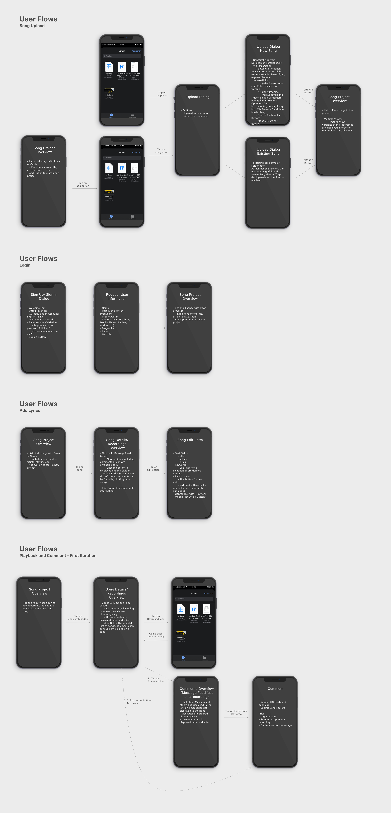
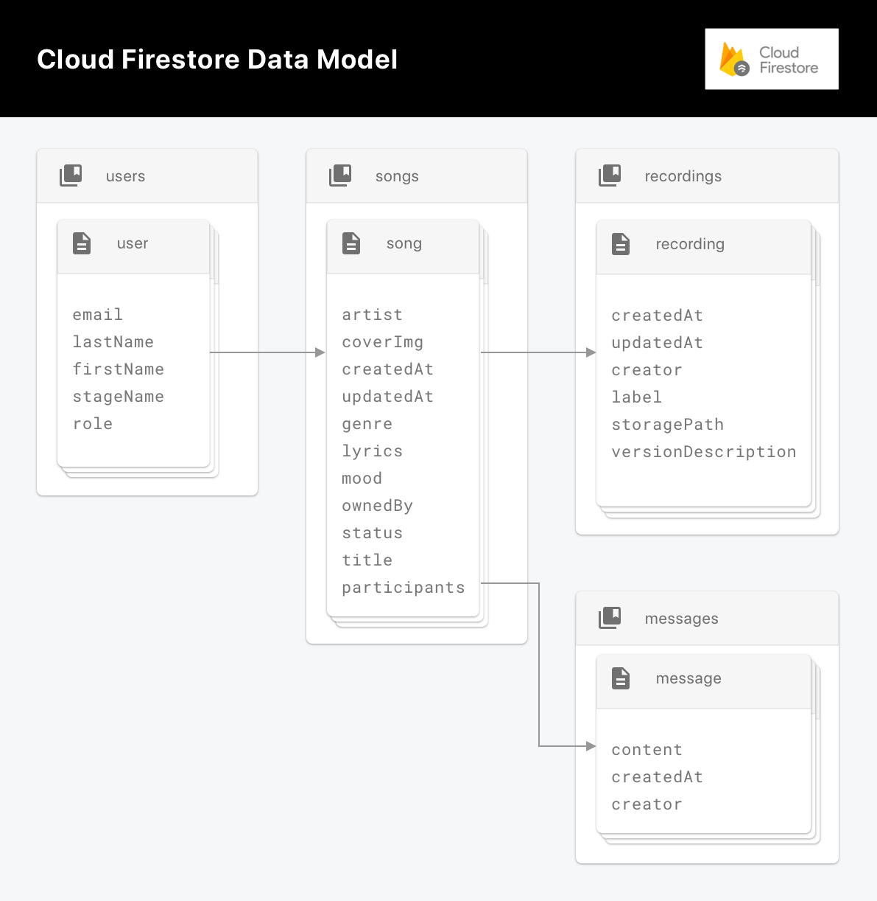
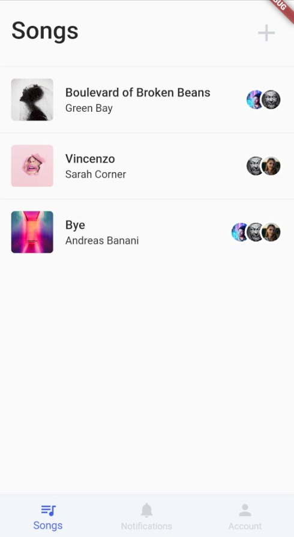

<h1 align='center' style='font-size:56px;'>Song Hub </h1><h4 align='center' style="font-weight: 200;color:#aaa">An App Development Project by Pascal Schlaak and Tim Weise (University of Aalen, summer semester 2020)</h4>

# Table of Contents

| Chapter                      | Page |
| ---------------------------- | ---- |
| App Description              | 3    |
| Competitive Analysis         | 4    |
| Wireframes                   | 8    |
| Personas                     | 14   |
| Color Scheme                 | 15   |
| Font                         | 15   |
| Architecture                 | 16   |
| App Principles               | 19   |
| Lessons Learned              | 21   |
| Author and Tasks             | 22   |
| Appendix A: Project Logs     | 23   |
| Appendix B: Image References | 33   |

# App Description

### Problem and Opportunity

Professional musicians usually create a lot of ideas and iterate on a big set of song projects with their partners. 

Often times this creative process is unstructured and supported by various different tools which leads to problems in communication.

An example would be that a musician sends the current version of his song project to his producer and the producer mixes the newest version up with a different version because his inbox is messed up by so many versions.

These issues originate from the fact that there is no project management platform for persons in the musical industry. 

Song Hub is the first step towards such a musical project management tool.

### Our Solution

Song Hub currently offers two main features: Song project versioning and song collaboration.

With versioning, both the producer and the song writer have a central place for storing audio files i.e. their different recordings for their projects as the songs progresses. This eliminates many problems that occur in actual project situations in which the exchange of the songs is based around email communication or traditional cloud storage providers. E.g. there is no chance that a new song version gets lost in an email inbox that is not suited for project file exchange. 

Furthermore, song collaboration features are provided such as a discussion area that is specific to a song project. The discussion area is designed to be used alongside with the recording versions so that one can always refer directly to a specific version in the creation process.

### Stakeholders

The music industry is dominated by the three major labels Sony Music Entertainment, Warner Music Group and Universal Music Group. Furthermore there are many independent labels.

Professional musicians that are signed by a label are usually in constant exchange with various producers, A&R managers, and other musicians. 

All these stakeholders benefit from our solution.

### App Features

#### Released features

The App currently offers user authentication with email and password, a song project view, a discussion area, a recording version area, a minimalistic audio player and a user profile area.

#### Backlog

Our next steps would be filtering and pagination for song projects and recording versions, push notification support and a dedicated feed view.

# Competitive Analysis

This competition analysis clarifies which competitors we had to consider in our use case and how they operate in the market. Our goal is to identify market gaps and integrate them into our app. As a result we want to show what the unique selling points of our app.

During our research we have identified only a few products from the following competitors:

* Auddly
* Songspace
* Synchtank
* Soundgizmo

### Competitors

In this section we want to give a short but detailed overview of each competitor. Every product is documented with app screenshots and the most used features will the be compared to our approach.

#### Auddly

[Auddly](https://auddly.com/) is a data hub to store songs, control its content and rights. A user can add songs, recordings, memos and lyrics in the app. Member invitations and split shares are also possible. A user can add and update songs by adding different progresses and write song specific comments.

However, a user can not set recording specific descriptions. Therefore users can't express to other members what his/her thoughts were while creating the recording. Comments can be written on the respective recordings. There is no possibility to communicate on song level. This app also focuses on the commercial aspects of music creation. The primary goal is to manage the data and to define split shares. The app's user interface is very well done, modern and up-to-date. All functions are intuitive to use.

#### Songspace

[Songspace](https://songspace.com/) is a data hub to store music, lyrics, collaborations and information around ones music. Like Auddly, users can keep track of ideas and songs. One can import voice memos and write lyrics.

In contrast to Auddly, songs are included in projects. Playing and sharing songs is possible but there is no feature that allows the upload of different versions or parts of a song. In our opinion the user interface is less modern and more conservative than Auddly. At certain points features are not intuitive enough and therefore actions are difficult to understand, too. This app focuses on the management of song projects on a centralized platform.

#### Synchtank

[Synchtank](https://www.synchtank.com/) is a data hub for managing entertainment assets, metadata and royalties in a centralized location.

Like Songspace, Synchtank focuses on the management of entertainment assets on a centralized platform. Assets can be uploaded and further information can be added. A playback of the assets is also possible. The user interface is nicely layed out and guides the eye of the user on the essential things. Synchtank does not have a native app, but is designed as a responsiv browser application.

#### Soundgizmo

[Soundgizmo](https://www.soundgizmo.com/#madeByMusicPeople) is a service with which an artist can manage his assets catalog, monitor opens, streams and downloads and monetize his creations using in-depth pitching and licensing tools.

Soundgizmo is a subsidiary of Synchtank and focuses on the analysis of media assets. The service can only be used upon request. The user interface of the app looks outdated but the general functionality is still understandable. Soundgizmo doesn't ship with a native app either and can only be used as a web application in the browser.

### Uniqueness 

After this competitive analysis, in which we identified pain points in the creation of music, we tried to define and extend unique selling points of our app. 

The following table shows the competitors mentioned above, their features and our ideas. If an application has the specified feature, it is marked with an "X". Otherwise a "-" is noted.

| **Feature**                                    | **Songspace** | **Synchtank** | **Soundgizmo** | **Auddly** |
| :--------------------------------------------- | ------------- | ------------- | -------------- | ---------- |
| Song overview                                  | X             | X             | X              | X          |
| Song details                                   | X             | X             | X              | X          |
| Add/edit song                                  | X             | X             | X              | X          |
| File organizer                                 | X             | X             | X              | X          |
| Comments        | -             | -             | -              | X          |
| Chat            | -             | -             | -              | -          |
| Audio player                                   | X             | X             | -              | X          |
| Version control | X             | -             | -              | X          |

We have found that all applications deal with the commercial side of music creation. Be it split shares or the analysis of song streams. We have decided to concentrate on the creative side of music creation. Besides features like adding songs and inviting members, which are essential for the management of music data, we would like to optimize the following features or include them if new (_see red markers in feature table above_).

#### Recording feature

An artist should have the possibility to upload and manage different versions or parts of his song in the form of recordings. He has the option to keep previous versions and to reuse them if necessary. By adding a short description and a label, the user, as well as other members, should be able to better understand the author's intention when creating the file.

#### Discussion feature

A user should be able to exchange information with other members of the project. In Auddly this aspect has already been addressed by a comment function, but in our opinion the feature is not well solved. A chat feature should allow members to exchange ideas, rate current files and progress and plan how to proceed. This way all members can be kept up to date on the current state of affairs. Questions and explanations of ideas become possible. In our opinion, an extended exchange of ideas can significantly improve the experience of music creation.

# Wireframes

As a high fidelity wireframing tool we used [Adobe XD](https://www.adobe.com/de/products/xd.html?sdid=88X75SKP&mv=search&ef_id=EAIaIQobChMI182Z_6e76gIV2-vtCh3WjQufEAAYASAAEgLvkvD_BwE:G:s&s_kwcid=AL!3085!3!340667133503!e!!). It is a free to use UI- and UX-prototyping tool, which allows us to create app wireframes for various devices. Individual components can be defined and reused which resembles the UI component approach that can is used in development. In a prototyping environment the individual screens can be linked, animations can be defined and tested in a simulator. We used [Sketch](https://www.sketch.com/) to design documentation elements and to sketch out diagrams for our architecture and user research results.

### First Iteration: User Flows

As it is common in User Centered Design, we started prototyping on a conceptual level and refined our prototypes after an evaluation stage. 

The first iteration on prototypes was a wireframe that described just the user flow through the application without user interface elements. This was done using Sketch as a prototyping tool.

### Second Iteration: High Fidelity Prototype

**License note**: All image assets were downloaded from [Unsplash](https://unsplash.com/) and are copyright free. The used icons are part of the [Google Material Icon Set](https://github.com/google/material-design-icons) which is licensed under a Apache 2.0 License. Our design system is heavily inspired by the [Google Material](https://material.io/) and [Apple Human Interface Guidelines](https://developer.apple.com/design/human-interface-guidelines/).

In general, we have tried to keep everything relatively minimalistic in the UI and UX. The app should be intuitive to use and contain common conventions. Our design language is more in line with Apple's guidelines, whereby we have tried to adapt the material components.

We try to keep our app as responsive as possible, as our use case could cover a wide range of devices. But since we see the most potential in smartphones, we have designed our app mobile first. Smartphones offer the most potential in our use case, because one can quickly capture ideas without forgetting them on the way to your computer or tablet.

### Sign Up, Sign In and Setup Profile

After starting the app, the user is first shown our Sign In view, unless the user had already logged in before and is not opening the app for the first time. Only username and password are required in the Sign In screen. If a user has not yet registered, he can be redirected to the Sign Up screen via a route below. In the Sign Up screen the user will be asked to create an account using a username, email and password. After successful validation of the entered data, the user is redirected to his profile page, where he can or must enter further information about himself. Once a user has successfully logged in and set up his profile, he can navigate to the first tab of the app.

### Project Overview

The first tab of the application contains a list of all song projects of the user or one of his musical partners. These song projects are displayed as a list of entries/rows and contain general information to characterize the project. An entry consists of a cover image, title, artist and participating members. Selecting a list entry allows navigation to the respective details. In the header of the view there is a button for adding new song projects next to a title. To create a song project, the user is presented with a mask in which he can enter and select information about the new project. Adding is confirmed by pressing a button. The user is then redirected to the project overview.

### Project Details

The previously mentioned detail view displays general information of the project, provides the possibility to edit it and contains the main features in the body. The header contains the same information as in the song overview to maintain data consistency. An edit icon redirects the user to the mask already known from adding song projects in which the entered data is displayed and can be edited

### Recordings feature

The body of the details view of two tabs from which the Recording Tab (_Files_) is selected by default. In this section all recording files of the project are displayed in a grid. The advantage of a grid is the possibility to show more details than e.g. in a list type view. The grid items show the date of creation, a label to classify the file and a short description of the content or intention. Furthermore, a picture of the creator shows who uploaded the file. Every file also has a playback feature to listen to the recording.

The first entry in the grid shows a button, which allows adding recording files. When pressed, the user is directed to a form for uploading where the user can select a file on his device and set the respective details.

For the sake of consistency, again, the same form is used for editing the recording. This can be reached by tapping the grid item.

### Discussion feature

The second tab of the detail view contains the discussion feature. Here members that participate in a song project can exchange informations on the song level. For this purpose, a chat with outgoing messages on the right and incoming messages from other members on the left is displayed. This convention of a chronological message history was adopted from existing messengers like WhatsApp or Telegram. In order to be able to reference a certain file, the linking from files to messages and an inline recording player for the linked file that snaps to the top of the chat were sketched out. 

# Personas

The following graphic shows both user roles (artist and producer) that are represented in our application. The description of each entity is broken down into roles within the music industry, personal goals and pain points in current projects.

To be able to consider the needs of these personas in the development of the app, we defined the following user stories:

##### Artist

- As an artist, I want to be able to organize my music projects by collecting my ideas centrally to focus on creativity. 
- As an artist I would like to share and discuss my current progress with participating entities, so that I can incorporate feedback and suggestions for improvement into my creative process.

##### Producer

- As a producer, I would like to be kept informed about the process of making music with a collaborating artist so that I can better understand their ideas and incorporate them into my creative part.

# Color scheme

Even though we used Material widgets for most of our base UI components, we decided not to use the Material color system but define a custom, minimalistic set of colors with only one accent color and a "danger-type" color to indicate errors.

The accent color is ultramarine blue and is used as primary color on button backgrounds, tab active indicators and status labels.

Furthermore there are two shades that are variations of that ultra marine blue for surfaces: Cadet Blue Crayola and Light Gray.

Both have almost the same hue value and a reduced saturation, in other words both can be created by blending in white into the ultramarine blue.

# Font

We tried out several fonts during the development of our app, but found the default *Roboto* font the most appropriate. Since we use a very minimalist and clear design structure, this geometric sans serif font fits very well.

# Architecture

### Information architecture

Our App is based around a reference architecture of Andrea Bizzotto which he calls [Stream-based Architecture for Flutter & Firebase Realtime Apps](https://github.com/bizz84/starter_architecture_flutter_firebase). 

This architecture consists of various layers, each with its own, distinct purpose following the single responsibility principal.

The backend related tasks are abstracted using Firebase, which is a Backend as a Service (BaaS). Those tasks are **user authentication** (user sign in and user sign up with Email/Password Authentication), storing and providing **app data** in real time and storing **binary objects** like images or audio files. The services that fulfill those requirements are Firebase Authentication, Firebase Cloud Firestore and Firebase Storage. In addition to that, the denormalized data gets updated by Firebase Cloud functions that are triggered when changes in the affected source documents occur.

The client side architecture leverages the unidirectional data flow pattern in which data flows downwards through all layers, ending at the widgets and events flow upwards, resulting in API calls.

The beforementioned application layers are the Domain Layer, the Presentation Layer and the UI Layer: 
The Domain Layer consists of so called **services**, which are stateless, singleton classes that expose pure functions. These functions serve as an abstraction over the Firebase APIs and transform the data to a domain-specific format using data **models**. Data models itself are **immutable**, strongly typed classes that define a named constructor `fromMap()` to deserialize the JSON format which is a Dart `Map` into a class instance.

The Presentation Layer uses so called **view models** which are classes that access the service functions and expose the data in the format that the corresponding widgets expect. Usually, the view model functions combine different streams using the Stream extension APIs from **rxdart**.

The UI Layer uses the **provider**-Package to make the stream data available to all descending child widgets and to provide scoped access to the services from within the widgets. In addition to that, the UI layer uses the **StreamBuilder** widget to build the widgets with the realtime snapshots of the streams. As of the time of writing, "Provider is the recommended way to do State Management for apps of all sizes." (**Chris Sells – Product Manager, Flutter**. June 19, 2019).

### Data persistence and permissions

As mentioned before, we used Cloud Firestore and Firebase Storage to persist the user data. 

Cloud Firestore is a realtime NoSQL, document based database. These kinds of databases store data in the form of **documents** that get organized in **collections** which are groups of documents.

Since Cloud Firestore supports so called **Collection Group Queries**, which allows to query documents across parents by their collection ID, we decided to organize our data in a nested form with many subcollections.

The schema is **denormalized** which means that there is duplicated data and the documents are optimised for fast reads without joins. As a result in most of the client views one realtime listener on either a collection, a document or a collection group is enough to retreive all relevant data for that view.

To keep the denormalized data in sync, a strategy to update the duplicates is needed. We decided to address this topic with Firebase Cloud Functions which are serverless functions that are deployed to Firebase and automatically run on certain triggers. 

Finally a concept for permissions is needed as the system requires user collaboration. Cloud Firestore comes with so called **Security Rules** which allows to restrict document access based on parameters like the authId of the request but also on information that is stored on the ressources that are accessed. As an example, to share access on songs we then defined a property `participants` on the song document which holds all userIds that have read, write and update access. This property could then be accessed in a Security Rule and access could be restricted to users that are part of that participants array.

##### A diagram of the resulting NoSQL data model can be seen below

# App Principles

 

### Design Guidelines

##### Material Components (lecture notes 6, page 3 - 7)

We use many different material widgets as the basis of our own customized components. Flutter's Material Widgets offer us the basis of our own customized components. The separation of a shared component set leverages consistent usage and design language. For example, we have developed our own App Bar, which looks similar on all screens and exposes an API for customization.

##### Apples Human Interface Guidelines (lecture notes 4, page 15 - 16)

Our design language is a mixture of Google's Material Design and Apple's Human Interface Guidelines in that e.g.  standard material UI widgets were restyled to match an iOS inspired color scheme.

### User Experience (UX)

##### UX Hierarchy of Needs (lecture notes 5, page 3)

We started designing our app with a with a focus on functionality and usability i.e. we were focused on the costumers needs in every step. In further iterations we used high fidelity prototypes to guarantee convenience and pleasure.

##### User Expectations (lecture notes 5, page 3, lecture notes 6, page 11)

Our design language uses a set of reusable widgets to guarantee consistency throughout the application. These widgets implement common conventions regarding functionality and look & feel. The users cognitive load is kept minimal due to our minimalistic convention based approach. 

##### User Centered Design (lecture notes 5, page 8)

We have developed our application according to the user-centered design. In a research phase we defined our target group, personas, user requirements for the app and the environment. In a user flow diagram we have recorded which actions a user needs when using our app, in order to be able to specify our layout. 

##### UI Navigation (lecture notes 5, page 9 - 42)

We use existing navigation concepts for our app, such as a hierarchical navigation. We use a nested doll navigation for our main functionality, whereby we have a tabbed view in the app's start screen.

### Android concepts

##### Confirm/Acknowledge Concept (lecture notes 2, page 24)

We applied the confirm/acknowledge concept using snackbars and alert dialogs.

##### Android inspired controls and layout (lecture notes 6, page 8 - 10)

We are currently using a scroll-based layout in our song overview. For dropdown menus in our modals we use the concepts of Androids Floating Context Menus. We use custom designed buttons to confirm actions that trigger changes. We use dialogs to warn the user about actions with consequences that cannot be undone. This is mainly used for delete actions (see song, recording delete). We use floating context menus to present the user with a pre-selection of fixed inputs. We use this layout in all dropdown menus.

### Mobile UI navigation

##### Modularized Navigation Graphs (lecture notes 6, page 12)

We have optimized our navigation so that e.g. a user doesn't have to switch back to the overview to edit a song in the details view but can rather access it directly via an edit icon.

##### Navigation Patterns (Lecture notes 6, page 14, 15, 16, 22, 24, 26, 29, 32, 33, 34, 35)

We use a list view to display several song projects on the homepage of our app. We use a tab bar at the bottom of our app as navigation between profile, projects and notifications. Search forms are used to search for participants. A user can invite other members via their email in  the song modal. In our song overview songs are sorted alphabetically by title. For recordings and messages this is done according to their creation date. These concepts are used by many apps and are therefore common to many people.

# Lessons Learned

Flutter and Firebase are highly trending technologies with lots of modern app development paradigms. Both of us learned data modeling using entities and relationships so the biggest challenge was to get into NoSQL concepts such as denormalization and document based data modeling. The results were impressive, we could encounter a drastically improved performance and seamlessly working realtime updates.

Working with realtime data streams was a second key takeaway and a relatively new concept to both of us. Dart was the first language we used that comes with built in support for data streams. Even though this enabled the most of use cases we still had to dive deeper and use extensions from `rxdart` for functional programming and stream composition with methods like `switchMap` or `Rx.combineLatest2`.

Another learning factor was the runtime type checking features of Dart which helped a lot in finding bugs.

All in all the biggest takeaway was the architectural patterns for state management and widget composition that apply to both Flutter and other reactive frameworks like React.js / React Native: We did several refactorings to further minimalize mutable state in our application and keep the widgets clean and separated. 

The two biggest challenges in this process were the following: Firstly to find the right APIs for shared widgets that were both applicable to all possible variants and concise and secondly to find the right place to locate mutable state. 

With the concepts "lift state up", view models and InheritedWidgets (enabled by the provider package), we could finally get an approach that was scalable, reusable, clear and maintainable.

# Authors and Tasks

Since we are a group of only two people, we both worked on pretty much every file in the app. This applies to research, implementation and follow-up.

This is documented in the license header that is used in every source code file that was written by us:

~~~
// Copyright 2020 Pascal Schlaak, Tim Weise. Use of this source
// code is governed by an MIT-style license that can be found in
// the LICENSE file or at https://opensource.org/licenses/MIT.
/// Authors: Pascal Schlaak, Tim Weise
~~~

The following is an attempt to roughly sketch out the main competencies by person:

### App Tasks

##### Tim Weise

* Cloud Functions
* App architecture
* Backend service APIs
* Authentication

##### Pascal Schlaak

* Recording and discussion feature functionality
* Presentational widgets
* Native widgets (file and image picker, audio player)
* Styling and design system

# Appendix: Project Log

This chapter contains all sprint reports sorted by date.

## Exploratory Sprint

#### Date

29.04.2020 - 13.05.2020

#### Members

* Pascal Schlaak (MLD)
* Tim Weise (MIN)

### What did we accomplish?

After getting our idea approved, we started to set up our development environment consisting of **Adobe XD** as Wireframe/Prototyping tool, **Visual Studio Code** as an Editor.

#### Backlog tasks

| Task                          | Status      |
| ----------------------------- | ----------- |
| Refined idea                  | Done        |
| Competitive analysis          | Done        |
| Identify unique features      | Done        |
| Define functionality of App   | Done        |
| Requirements for MVP          | Done        |
| User stories                  | Done        |
| Define use cases              | Done        |
| Visualize data flow           | Done        |
| Research technologies         | Done        |
| General software architecture | Done        |
| Wireframes                    | In Progress |
| Information architecture      | In Progress |

#### Discuss competitive analysis

In our competitive analysis, we found the following competitors:

* Songspace
* Synchtank
* Soundgizmo
* Auddly

Pain points:

* They focus on commercial view
* Cloud data hub for projects
* Defining and calculating splits of participants
* General versioning of song progress

Our unique selling points:

* We want to focus on the creative perspective
* Feature to discuss the current version of song/components of song with participants
* More detailed versioning of songs/components

#### Wireframes

In our first wireframing approaches we accomplished:

* First iteration of wireframe consisting of stock material design elements
* Second iteration of wireframe simplifying layout (reduced hierarchy, removed unnecessary elements, ...)
* First system run

### What hinderances/risks did/do we face?

* Two Group members left because the other students chose different courses &rightarrow; Only two participants
* Different development environments (MacOS, Ubuntu, Sketch, XD, Android studio, VS Code, ...)

### What do we plan to tackle in the next sprint?

1. Improve wireframing
2. Setup flutter project and get more into technologies
3. Elaborate architecture

## Architectural Spike Sprint

#### Date

13.05.2020 - 27.05.2020

#### Members

* Pascal Schlaak (MLD)
* Tim Weise (MIN)

### What did we accomplish?

Set up our flutter project in Bitbucket repository. Structured project in components, screens, etc. Added first UI elements and refactored layout. Setup apps for iOS and Android in Firebase. Added Firestore with first collection and dummy documents. Added connection to Firestore instance from Flutter app to fetch dummy documents and render in *Songs overview* and *Song details*.

#### Backlog tasks

| Task                                                         | Status      |
| ------------------------------------------------------------ | ----------- |
| Setup Flutter project in repository                          | Done        |
| Structure Flutter project                                    | Done        |
| Develop UI elements (general use components/screen specifics) | In progress |
| Create navigator rules for view segue                        | Done        |
| Create providers for information flow                        | Done        |
| Created iOS and Android apps in Firebase and instantiated Firestore db | Done        |
| Specify Firestore dependencies in Flutter app                | Done        |
| Integrate Firestore connection and requests                  | Done        |
| Fetch dummy data from Firestore and render in app            | Done        |

#### Wireframes

Improved UI experience by reducing visual elements and refining user-flow. Reduced number of colors and specified drop shadows.

#### Feature table

Compared features of competitors to clarify our added value.

| **Feature**    | **Songspace** | **Synchtank** | **Soundgizmo** | **Auddly** |
| :------------- | ------------- | ------------- | -------------- | ---------- |
| Song overview  | X             | X             | X              | X          |
| Song details   | X             | X             | X              | X          |
| Add/edit song  | X             | X             | X              | X          |
| File organizer | X             | X             | X              | X          |
| **Comments**   | -             | -             | -              | X          |
| **Chat**       | -             | -             | -              | -          |
| Audio player   | X             | X             | -              | X          |
| **Version**    | X             | -             | -              | X          |

#### Integrate functionality

### What hinderances/risks did/do we face?

* Multi-platform development often resulted in errors after pulling changes and building for other os.
* Build process for iOS takes much longer than expected which is a document bug in Flutter Fire.

### What do we plan to tackle in the next sprint?

Demo core functionality:

* Integrate core feature(s)
  * Add/edit song
  * Prio B: Discussion
* Add more dummy data

## Alpha Sprint

#### Date

27.05.2020- 10.06.2020

#### Members

* Pascal Schlaak (MLD)
* Tim Weise (MIN)

### What did we accomplish?

We integrated user authentication to later allow multi user collaborations. Songs are now mapped to a user/owner. We added security rules in Firestore and Storage to restrict access.  A user can now register or sign in to the app by email and password. A user can now add new song projects and edit existing songs projects.  While editing a song a user can enter required files and add a cover image from the OS device gallery. We also refactored the data stream to fetch song objects. Details of a song now contain files, which are also fetched from dummy data in Firestore. Several front end components for the discussion feature were added too. 

#### Backlog tasks

| Task                                            | Status      |
| ----------------------------------------------- | ----------- |
| Integrate multi user authentication             | Done        |
| Add "Sign In" and "Sign Out" screen             | Done        |
| Refactored Firestore and Storage schema         | Done        |
| Add user access rules for Firestore and Storage | Done        |
| Add more dummy data                             | Done        |
| Refined "Add Song" screen                       | Done        |
| Created "Edit Song" screen                      | Done        |
| Refactored Firestore stream                     | Done        |
| Create "Records" feature in "Song Details"      | In progress |
| Create "Discussion" feature in "Song Details"   | In progress |

#### Wireframes

Improved UI experience by reducing visual elements and refining user-flow.

#### Integrate main technologies

Our main features exist of user authentication, data streams and song details.

### What hinderances/risks did/do we face?

* Database schema required multi stream concatenation &rightarrow; Refactored Firestore and Storage schema 
* Exceeding Storage free plan every afternoon due to too high data exchange

### What do we plan to tackle in the next sprint?

Feature complete:

- Implement all features (mostly backend services)
- Finish "Add Song" and "Edit Song"
- Integrate file picker and upload
- Integrate message upload and fetch
- Optional: Integrate multi user collaboration

## Beta Sprint

#### Date

10.06.2020 - 02.07.2020

#### Members

* Pascal Schlaak (MLD)
* Tim Weise (MIN)

### What did we accomplish? 

We decided to refactor our Firestore database model again due to improvement opportunities. We added error handling especially for features where we initiate connections to Firebase. Integrated snackbars can now show the status in many features.

#### Backlog general tasks

| **Task**                                                     | **Status** |
| ------------------------------------------------------------ | ---------- |
| Refactor database model                                      | Done       |
| Refactor user authentication                                 | Done       |
| Error handling of firebase functionality with snackbar status | Done       |
| Cloud functions to handle database entry updates and recursive deletion | Done       |

We refactored user access to display only granted information. Furthermore, we added the user settings feature in the account view to add and update user data.

#### Backlog users feature

| **Task**                                                     | **Status** |
| ------------------------------------------------------------ | ---------- |
| Refactor user authentication and restrict access by security rules | Done       |
| Add user settings modal                                      | Done       |
| Add database functionality to add and update user data       | Done       |
| Complete users feature                                       | Done       |

Completed the refactoring of the app architecture to allow easy upscaling if required later. Refactored backend service APIs based on new view models.

#### Backlog app architecture

| **Task**                                                     | **Status** |
| ------------------------------------------------------------ | ---------- |
| Restructure app directories                                  | Done       |
| Refactor backend service APIs for Authentication, Database, Storage | Done       |
| Add view models layer for models                             | Done       |
| Refactored app architecture for easy upscaling               | Done       |

Refactored song modals to get functionality back working with new app structure. Added image processing to uploading image. Added validation of song modal forms. Currently implementing participant invitation feature we decided to integrate if we have time as a team of only two members.

#### Backlog songs/project feature

| **Task**                                      | **Status**  |
| --------------------------------------------- | ----------- |
| Add database functionality to song modals     | Done        |
| Add image processing to image upload          | Done        |
| Add form validation                           | Done        |
| Add participants form to invite collaborators | In progress |
| Complete songs feature                        | In progress |

Refactored recording feature. Made recording tab fully responsive to display on different devices. Created real time data stream to view and update files. Implemented file picker to read files from device and upload to storage. Added more information to recording like 'updatedAt' timestamp. Implemented add and edit modals for adding and updating recording entries. Redesigned recording items to be fully responsive too. Added simple audio playback in recording item by pressing icon.

#### Backlog recording feature

| **Task**                                                     | **Status** |
| ------------------------------------------------------------ | ---------- |
| Refactor recording feature grid to be responsive             | Done       |
| Refactor recording item tab to be responsive and redesign    | Done       |
| Create real time data stream                                 | Done       |
| Complete file picker functionality                           | Done       |
| Refactor data structure recording collection                 | Done       |
| Add recording modals for add and edit functionality          | Done       |
| Add database push and update functionality for recording modals | Done       |
| Refactor and redesign recording modals                       | Done       |
| Add simple audio playback of recording file in cloud storage | Done       |
| Complete recording feature                                   | Done       |

Refactored and redesigned components of discussion features (message container, message input, tab view). Feature is no fully responsive too. Defined data structure for messages in Firestore. Messages will be aligned in canvas depending on user. Added functionality to push message to cloud database. Defined security rules to restrict access to feature.

#### Backlog discussion feature

| **Task**                                                 | **Status** |
| -------------------------------------------------------- | ---------- |
| Refactor and redesign discussion components              | Done       |
| Refactor discussion feature tab to be responsive         | Done       |
| Create real time data stream                             | Done       |
| Define data structure messages collection                | Done       |
| Render messages depending on user and order by timestamp | Done       |
| Add push functionality for message input form            | Done       |
| Add security rules for discussion feature                | Done       |
| Complete message feature                                 | Done       |

### What hinderances/risks did/do we face?

* Due to our team constellation, we had much afford to realize full feature functionality 
* Poor Flutter Firebase documentation for specific features
* Difficulties in extending the app architecture for use cases that are not fully standard use cases intended by the Firebase APIs

### What do we plan to tackle in the next sprint?

- Create documentation
- Testing and debugging features
- Polish app including UI
- Prepare for certification and submission

# Appendix B: Image References

S. 4: https://apps.apple.com/gb/app/auddly/id920392244?l=de

S. 5: https://apps.apple.com/us/app/songspace/id647346234

S. 6: https://www.synchtank.com/wp-content/uploads/2020/02/search.webp

S. 6 : https://www.soundgizmo.com/images/MacbookAirScreen1.png

S. 17: https://firebase.google.com/images/brand-guidelines/logo-standard.png

S. 17: https://flutter.dev/assets/flutter-lockup-1caf6476beed76adec3c477586da54de6b552b2f42108ec5bc68dc63bae2df75.png