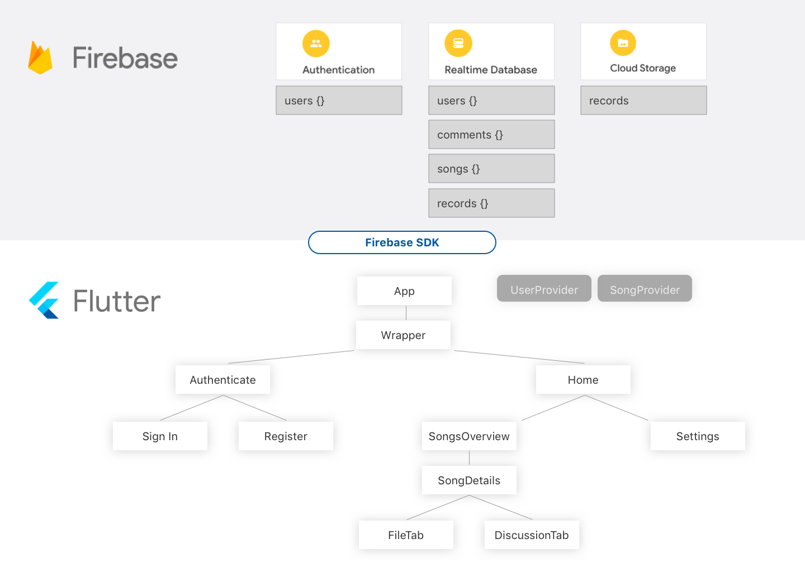

# Exploratory Sprint

### Date

29.04.2020 - 13.05.2020

### Members
* Pascal Schlaak (MLD)
* Tim Weise (MIN)

## What did we accomplish?
After getting our idea approved, we started to set up our development environment consisting of **Adobe XD** as Wireframe/Prototyping tool, **Visual Studio Code** as an Editor.

### Backlog tasks

| Task                          | Status      |
| ----------------------------- | ----------- |
| Refined idea                  | Done        |
| Competitive analysis          | Done        |
| Identify unique features      | Done        |
| Define functionality of App   | Done        |
| Requirements for MVP          | Done        |
| User stories                  | Done        |
| Define use cases              | Done        |
| Visualize data flow           | Done        |
| Research technologies         | Done        |
| General software architecture | Done        |
| Wireframes                    | In Progress |
| Information architecture      | In Progress |

### Discuss competitive analysis
In our competitive analysis, we found following competitors:

* Songspace
* Jammber
* Synchtank
* Soundgizmo
* Auddly

Pain points:

* They focus on commercial view
* Cloud data hub for projects
* Defining and calculating splits of participants
* General versioning of song progress

Our unique selling points:

* We want to focus on creative point of view
* Feature to dicuss current version of song/components of song with participants
* More detailed versioning of songs/components

### Wireframes
In our first wireframing approaches we accomplished:

* First iteration of wireframe consisting of stock material design elements
* Second iteration of wireframe simplifying layout (reduced hirarchy, removed unnecessary elements, ...)
* First system run

### Information architecture

## What hinderances/risks did/do we face?
* Two Group members left because they chose other modules &rightarrow; Only two participants
* Different development environments (MacOS, Ubuntu, Sketch, XD, Android studio, VS Code, ...)

## What do we plan to tackle in the next sprint?
1. Improve wireframing
2. Setup flutter project and get more into technologies
3. Elaborate architecture

