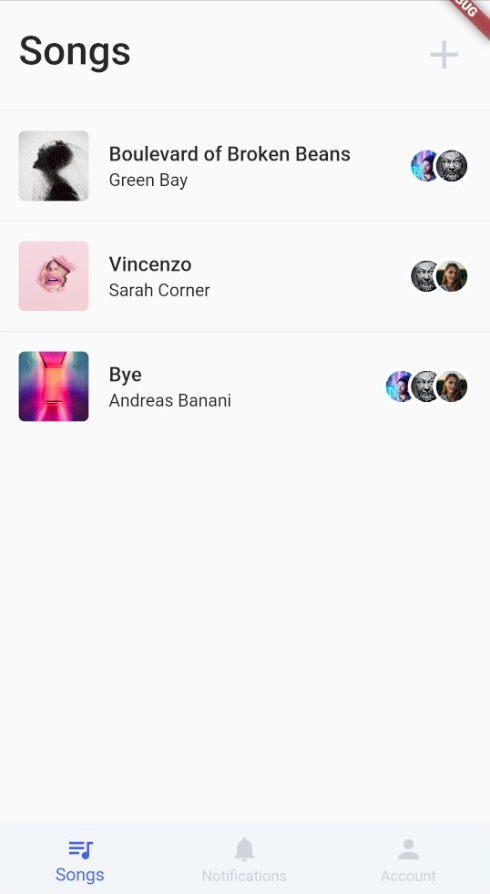

# Architectual Spike Sprint

### Date

13.05.2020 - 27.05.2020

### Members

* Pascal Schlaak (MLD)
* Tim Weise (MIN)

## What did we accomplish?

Set up our flutter project in Bitbucket repository. Structured project in components, screens, etc. Added first UI elements and refactored layout. Setup apps for iOS and Android in Firebase. Added Firestore with first collection and dummy documents. Added connection to Firestore instance from Flutter app to fetch dummy documents and render in *Songs overview* and *Song details*.

### Backlog tasks

| Task                                                         | Status      |
| ------------------------------------------------------------ | ----------- |
| Setup Flutter project in repository                          | Done        |
| Structure Flutter project                                    | Done        |
| Develop UI elements (general use components/screen specifics) | In progress |
| Create navigator rules for view seque                        | Done        |
| Create providers for information flow                        | Done        |
| Created iOS and Android apps in Firebase and instantiated Firestore db | Done        |
| Specify Firestore dependencies in Flutter app                | Done        |
| Integrate Firestore connection and requests                  | Done        |
| Fetch dummy data from Firestore and render in app            | Done        |

### Wireframes

Improved UI experience by reducing visual elements and refining user-flow. Reduced number of colors and specified drop shadows.

### Feature table

Compared features of competitors to clarify our added value.

| **Feature**    | **Songspace** | **Synchtank** | **Soundgizmo** | **Auddly** |
| :------------- | ------------- | ------------- | -------------- | ---------- |
| Song overview  | X             | X             | X              | X          |
| Song details   | X             | X             | X              | X          |
| Add/edit song  | X             | X             | X              | X          |
| File organizer | X             | X             | X              | X          |
| **Comments**   | -             | -             | -              | X          |
| **Chat**       | -             | -             | -              | -          |
| Audio player   | X             | X             | -              | X          |
| **Version**    | X             | -             | -              | X          |

### Integrate functionality

## What hinderances/risks did/do we face?

* Multi-platform development often resulted in errors after pulling changes and building for other os.
* Build process for iOS takes much longer than expected.

## What do we plan to tackle in the next sprint?

Demo core functionality:

* Integrate every UI element
* Improve functionality
* Add more dummy data
* Specify design language (color palette, element shadows)

