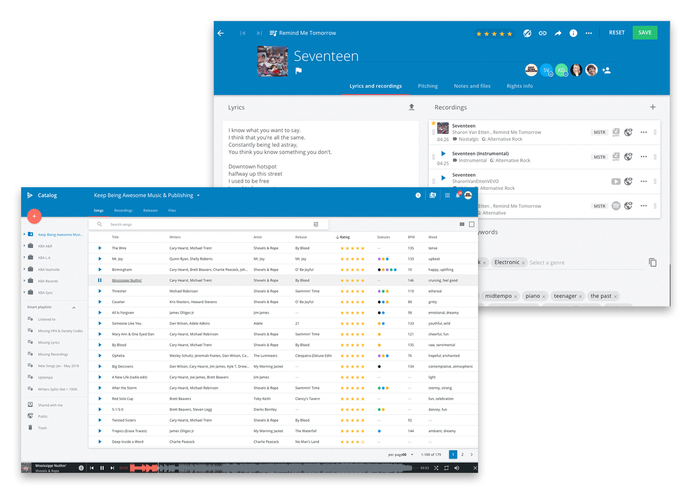
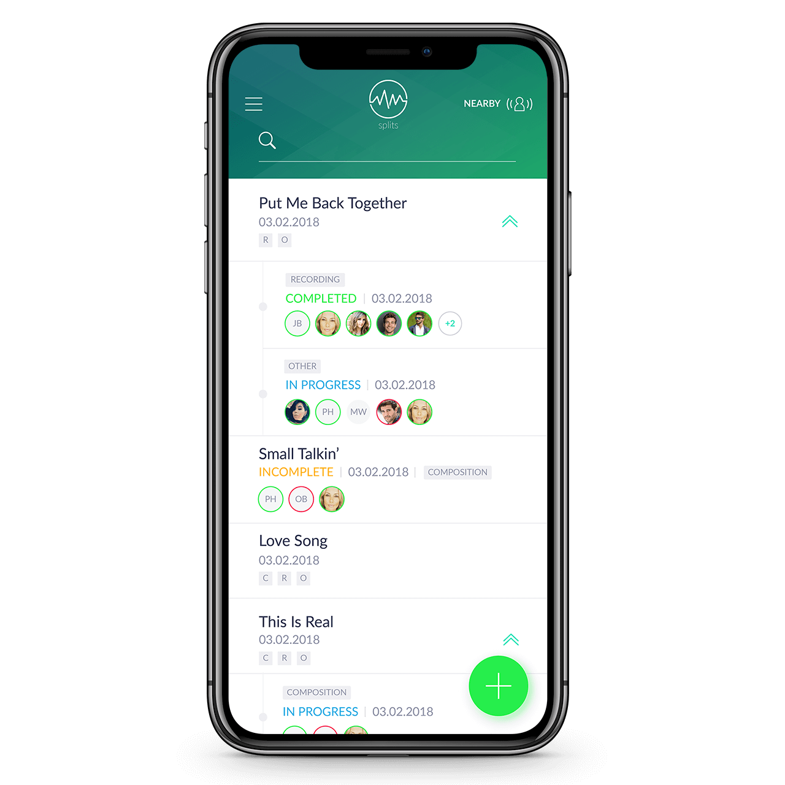
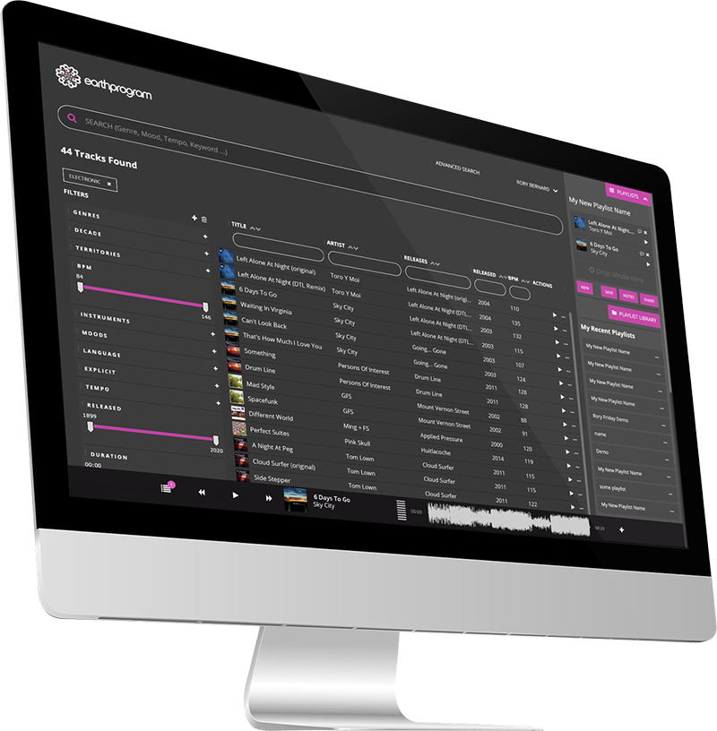
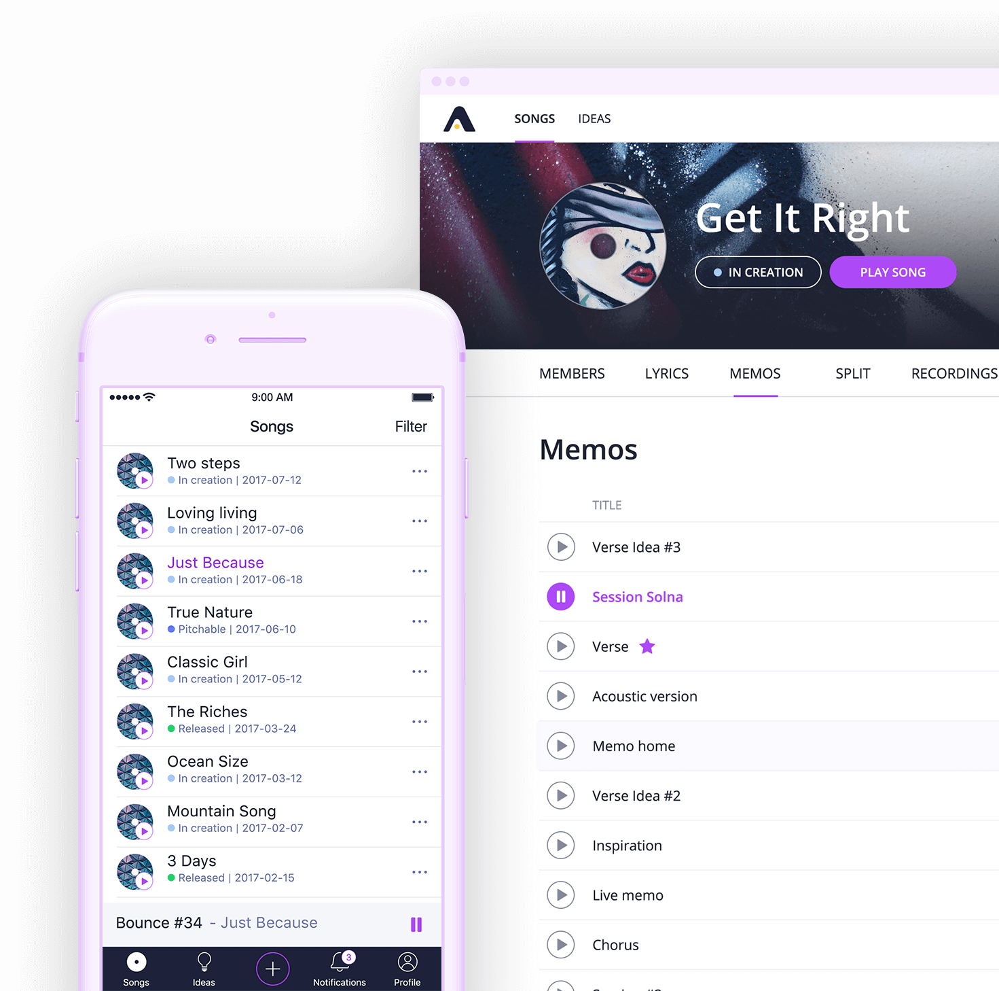

# Idea
Central management tool for suppoting creative music developing process. App should have following features:

* Organize and add new song projects
* Upload new components (e.g. vocals, instrumentals, ...) of the song (versioning and labeling of current progress)
* Discuss current progress and new song components with involved entities (e.g. producer, ...)

## Problem
Current music managing tools focus on commercial point of music developing.

## Competetive analysis

### Songspace
[Songspace](https://songspace.com/) catalog stores all of your music, lyrics, collaborations and information around your songs in one place. Keep track of ideas, songs and any versions added from collaborators. Import voice memos from your phone and save lyrics whenever inspiration strikes.

### Jammber Split + SplitPay + Money
[Jammber](https://www.jammber.com/) tracks songs but main focus on splits, payouts.

### Synchtank

[Synchtank](https://www.synchtank.com/) is a software solutions for managing entertainment assets, metadata and royalties. Store and manage all of your digital entertainment assets, rights information and metadata in a centralized location with scalable and secure cloud storage.

### Soundgizmo
[Soundgizmo](https://www.soundgizmo.com/#madeByMusicPeople) allows you to manage every aspect of your catalog's data, in-depth pitching & licensing tools, monitor opens, streams & downloads.

### Auddly
[Auddly](https://auddly.com/) is a data hub to control songs and rights, split shares. User can add and update songs by adding different progresses.

##### Pain points
* Comment feature not suited for discussing sample
* Versioning too general. Can just label sample as current version, can't add and discuss components of song
* Focusses on commercial point of view

## Innovation
We want to focus on the creative process of making music by:

* Managing all details when working on new music (creators should be able to upload e.g. instrumentals, ... not only the current song status)
* Deploy messaging feature to discuss every component of a song with multiple entities
