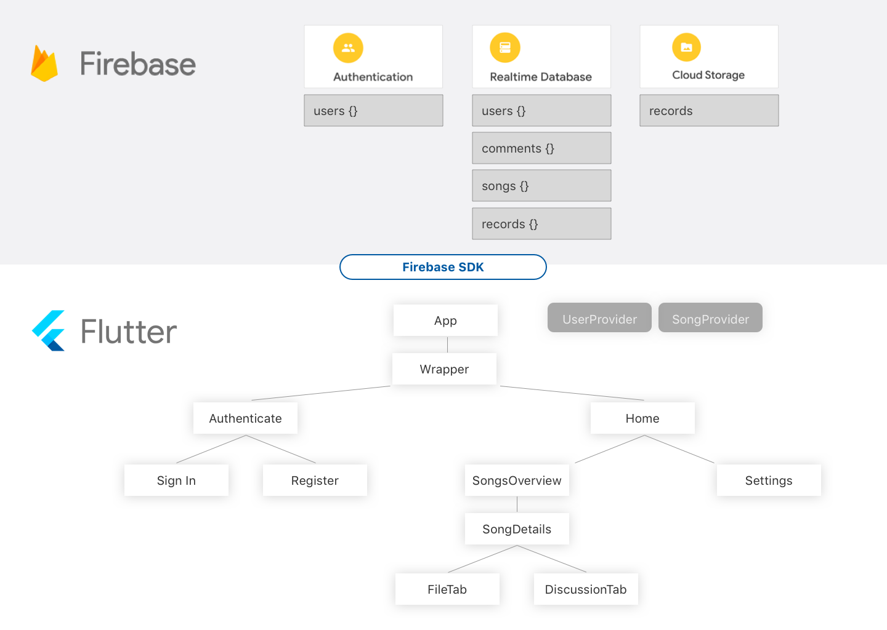

# Exploratory Sprint (29.04.2020 - 13.05.2020)

### Members
* Pascal Schlaak (MLD)
* Tim Weise (MIN)

## What did we accomplish?
* General division of tasks (Front-/Back-end)
* Idea development, competitive analysis, unique features
* First userflows, information flow and wireframes
* Setup and synchroniced development environment

### Discuss competitive analysis
Competitors:

* Songspace
* Jammber
* Synchtank
* Soundgizmo
* Auddly

&rightarrow;

* They focus on commercial view
* Cloud datahub for projects
* Defining and calculating splits of participants
* General versioning of song progress

Our unique selling points:

* We want to focus on creative point of view
* Feature to dicuss current version of song/components of song with participants
* More detailed versioning of songs/components

### Wireframes
We agreed to use [Adobe XD](https://www.adobe.com/de/products/xd.html?sdid=91BF525M&mv=search&ef_id=EAIaIQobChMI0_Wxkayw6QIVgbh3Ch2jswC6EAAYASAAEgI5OPD_BwE:G:s&s_kwcid=AL!3085!3!394597829423!e!!g!!adobe%20xd) as wireframe/prototyping tool and already accomplished:

* First iteration of wireframe consisting of stock material design elements
* Second iteration of wireframe simplifying layout (reduced hirarchy, removed unnecessary elements, ...)
* First system run

### Information architecture/technologies

## What hinderances/risks did/do we face?
* Two Group members left because they chose other modules &rightarrow; Only two participants
* Different development environments (MacOS, Ubuntu, Sketch, XD, Android studio, VS Code, ...)

## Questions
* Information architecture/technologies ok?
* Ok if we work as a group consiting of only two participants? We're fine

## What do we plan to tackle in the next sprint?
1. Improve wireframing
2. Setup flutter project and get more into technologies
3. Elaborate architecture

